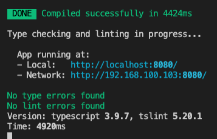

# ClientApp

### 1. Install packages

```bash
cd ClientApp
npm i
```

### 2. Run app

To make sure you don't get no type or lint errors:

```bash
npm run serve
```



### 3. Build app 

To make sure you get no errors when you deploy:

```bash
npm run build
```


