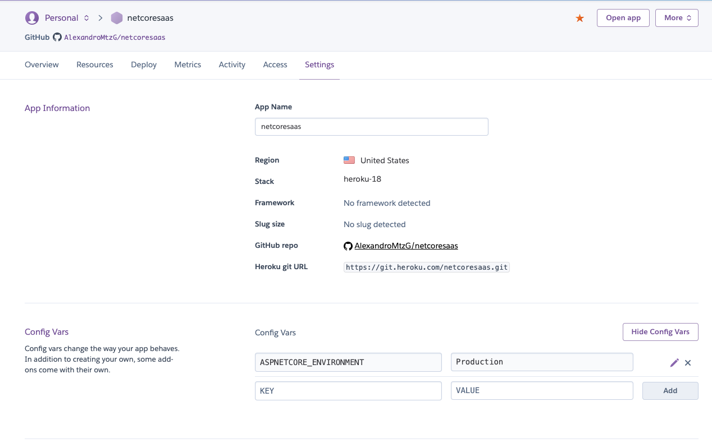
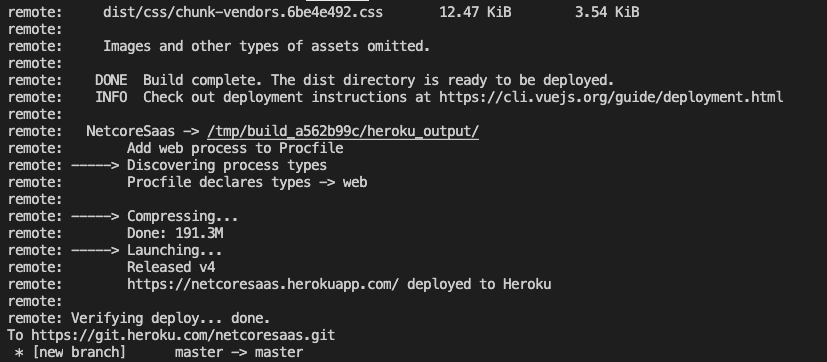

# Deploy to heroku

## Install Heroku CLI

If you haven't already, install the CLI: [https://devcenter.heroku.com/articles/heroku-cli](https://devcenter.heroku.com/articles/heroku-cli)

## 1. Connect a heroku app

### New app

Create your app manually at dashboard.heroku.com or type:

```text
heroku create your-app
```

### Existing app

If you've already created your app, connect it:

```text
heroku git:remote -a your-app
```

## 2. Adding Node.js and .NET Core buildbacks

.NET Core is not officially supported on Heroku at present. Third party buildpacks are one option for extending the platform, for this project we are using: [https://elements.heroku.com/buildpacks/jincod/dotnetcore-buildpack](https://elements.heroku.com/buildpacks/jincod/dotnetcore-buildpack)

```text
heroku buildpacks:add heroku/nodejs
heroku buildpacks:add jincod/dotnetcore
```

### Heroku environment variables

```text
heroku config:set ASPNETCORE_ENVIRONMENT=Production
```

You can change environment variables directly from the heroku app settings:



## 3. Deploy

You can directly push to the heroku repository:

```text
git push heroku master
```



Or better yet, go to [https://dashboard.heroku.com/apps/**YOUR-APP**/deploy/github](https://dashboard.heroku.com/apps/YOUR-APP/deploy/github) and enable **Automatic deploys** so you only deploy when you type:

```text
git push origin master
```

### 4. Open your app

Open your app yourappname.herokuapp.com and ensure everything is working.


If you set your LIVE Stripe API Keys and LIVE products, keep in mind that you will be charged.



