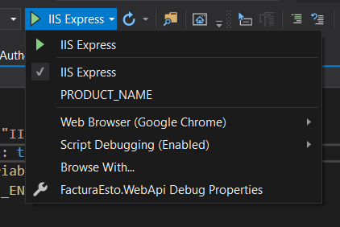
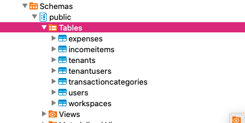
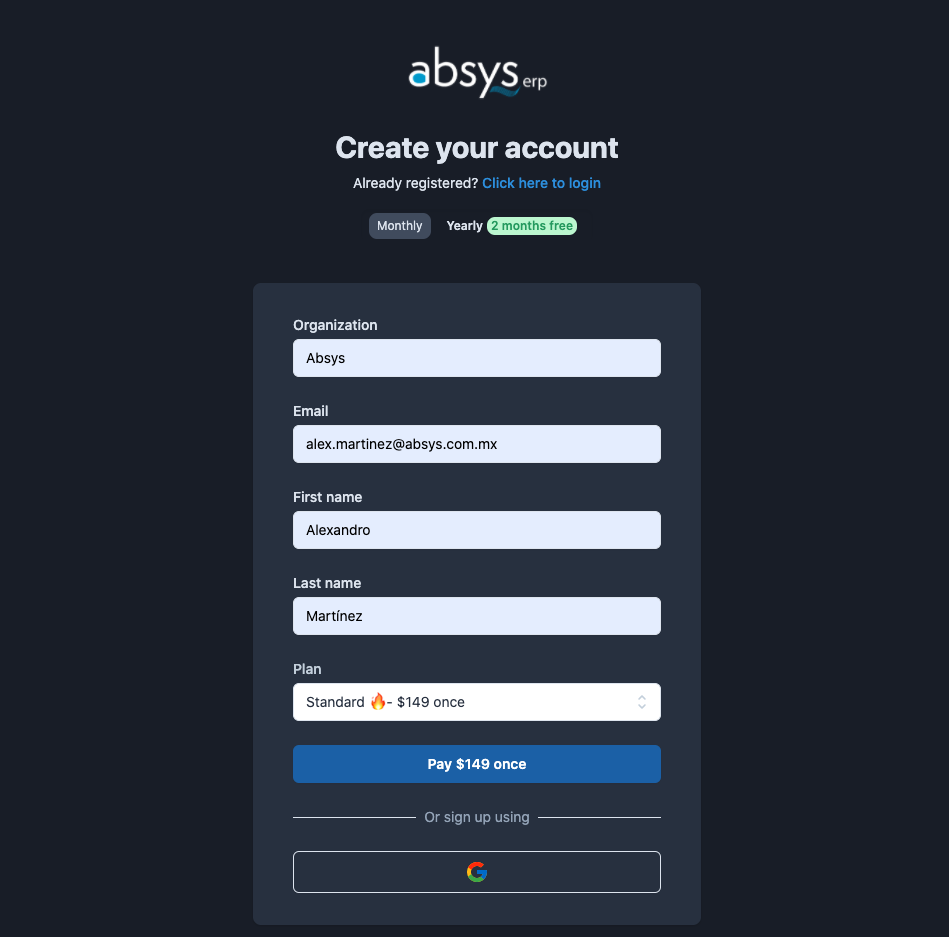
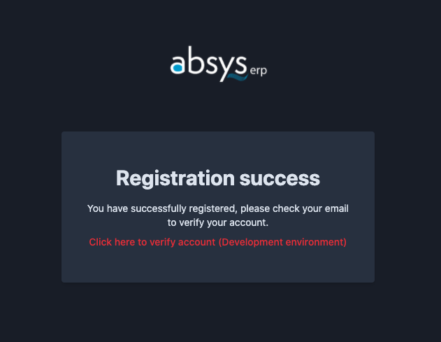
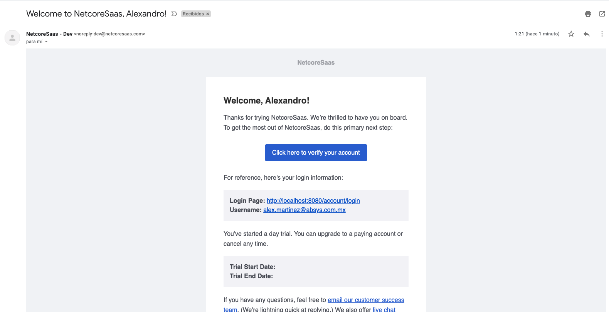
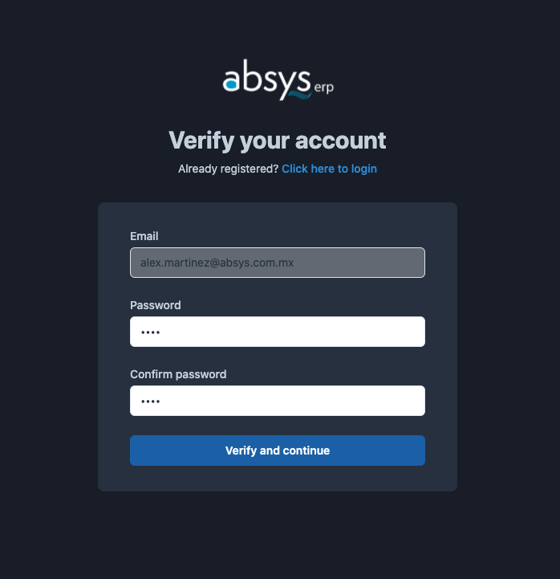
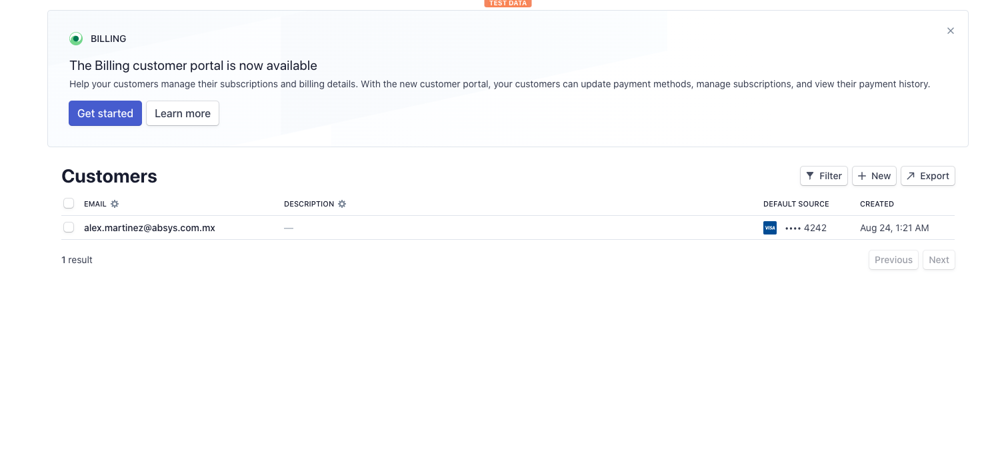
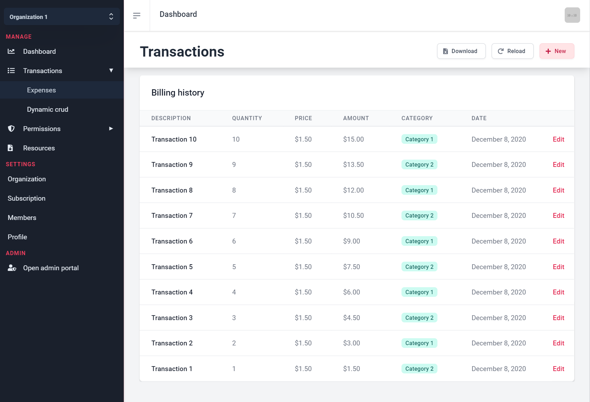

# Backend + Frontend

## 1. Restore packages

At the root directory:

```text
dotnet restore
```

## 2. Debug .NET + Client App

Start the app on Visual Studio with "PRODUCT\_NAME" launch configuration.



## 3. Database generated

And if you connect to your Database Provider you should see the tables created:



## 4. Register


If you [already set your Stripe](../../other/integrations/stripe/creating-subscriptions.md) products, you can register:






You can click the red text or go to step 5...

## 5. Email confirmation

If you set Postmark correctly \(by creating the welcome template\) you should get an email:



By clicking the blue button you will be redirected to [http://localhost:8080/account/verify](http://localhost:8080/account/verify):



## 6. Database records

Connect to your local database and confirm there are at least 1 record:

```sql
select * from "Users";
select * from "Tenants";
select * from "TenantUsers";
```

## 7. Stripe customer

Go to your Stripe dashboard and confirm the creation:



## 8. Your ready to start working on your SaaS core functionality



## 9. Optional: Test the Transactions page

Add an expense and confirm it:

```sql
SELECT * FROM "Transactions";
```

