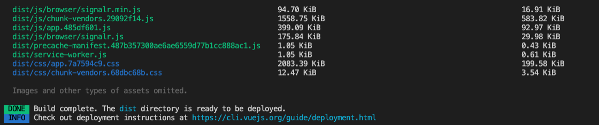

# Frontend

### Install packages

```bash
cd ClientApp
npm i
```

### Compile

Verify you don't have any TypeScript errors:

```bash
tsc
tsc --build --clean
```

### Build app

To make sure you get no errors when you deploy:

```bash
npm run build
```




