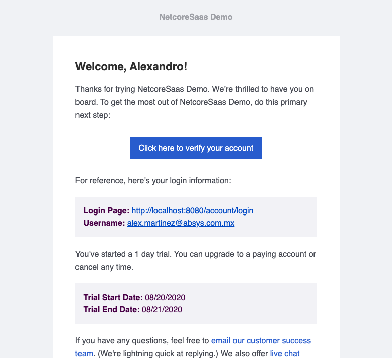

# Postmark

## Environment variables:

* [Backend](../../getting-started/environment/backend-netcore.md)
  * `EmailSettings:PostmarkSenderName`
  * `EmailSettings:PostmarkSenderEmail`
  * `EmailSettings:PostmarkServerToken`

Once you have your postmark account:

1. Setup a [Sender Signature](https://account.postmarkapp.com/signature_domains) and set`PostmarkSenderName`and `PostmarkSenderEmail`
2. [Create a Server](https://account.postmarkapp.com/servers), grab the **Server API token** and set ****`PostmarkServerToken`

## Email templates:

* Welcome**: Add this template and customize it** \(optional\)
* User invitation**: Add this template and customize it** \(optional\)
* Password reset**: Add this template and customize it** \(optional\)
* Comment notification
* Receipt
* Invoice
* Trial expiring
* Trial expired

### Example

