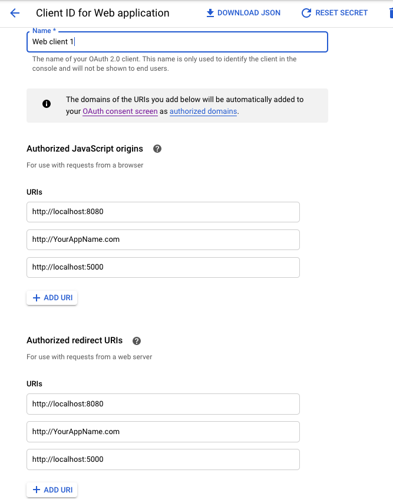

# Google Sign In

## Environment variables:

* [Frontend](../../getting-started/environment/frontend-vue.md)
  * `VUE_APP_GOOGLE_CLIENT_ID_OAUTH2`

Open [google developers console](https://console.developers.google.com/apis/credentials):

1. Click CREATE CREDENTIALS and set OAuth client ID
2. **Application type**: Web application
3. **Name**: Web client 1
4. **Authorized JavaScript origins** and **Authorized redirect URIs**:

