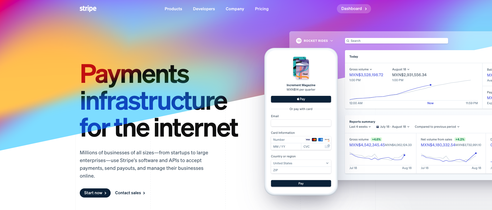

# Getting the API Keys

## Environment variables:

* [Backend](../../getting-started/environment/backend-netcore.md)
  * `Stripe:PublishableKey`
  * `Stripe:SecretKey`
* [Frontend](../../getting-started/environment/frontend-vue.md)
  * `VUE_APP_STRIPE_PUBLISHABLE_KEY`
  * `VUE_APP_STRIPE_SECRET_KEY`

## Configure your Stripe app

### API Keys

1. [Create your stripe app](https://dashboard.stripe.com)
2. Grab the [test API Keys](https://dashboard.stripe.com/test/apikeys)
3. And grab the [production API Keys](https://dashboard.stripe.com/apikeys)

