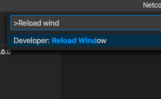

# 2. Install .NET Core SDK

### Install the latest stable NET 5 SDK release



### Reload VSCode

Type Command/Control + Shift + P and execute the "Developer: Reload Window" command.



### Build

Open the terminal in VSCode by typing Command/Control + J and type:

```text
$ dotnet build
```


