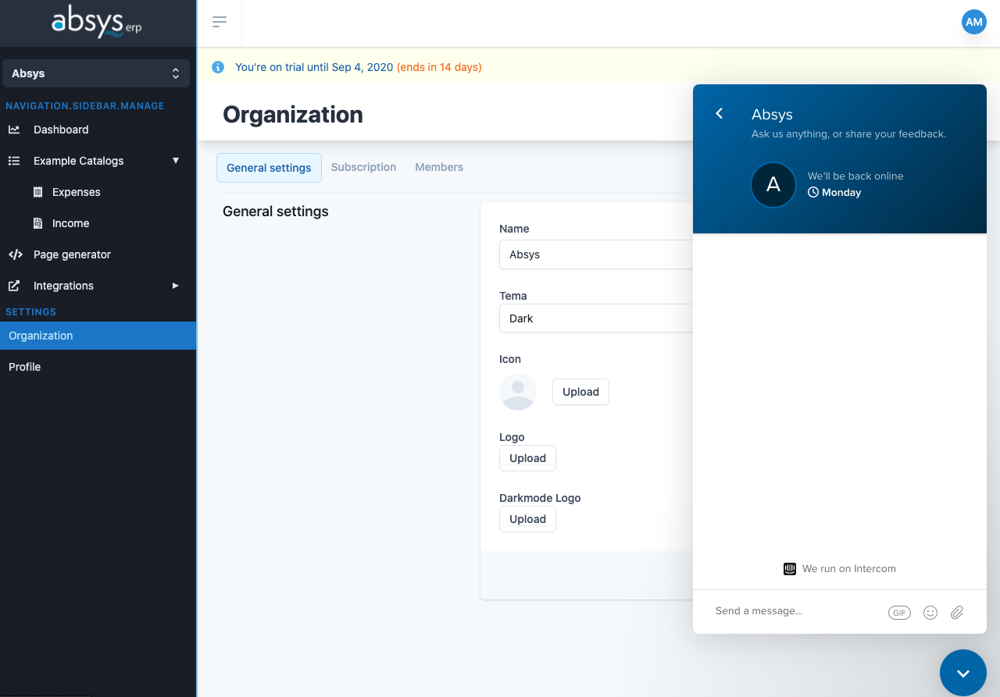

# Intercom


## Environment variables:

* [Frontend]()
  * `VUE_APP_INTEGRATIONS_CONVERSATIONS_INTERCOM`

### Marketing side

Uncomment line on file `ClientApp/srs/views/marketing/Index.vue`

```text
this.$intercom.show();
```

### App side

Uncomment these lines on file `ClientApp/srs/components/layouts/AppLayout.vue`

```text
this.$intercom.boot({
        user_id: this.$store.state.account.user.id,
        name: this.$store.state.account.user.firstName,
        email: this.$store.state.account.user.email,
      });
this.$intercom.show();
```

Example:




