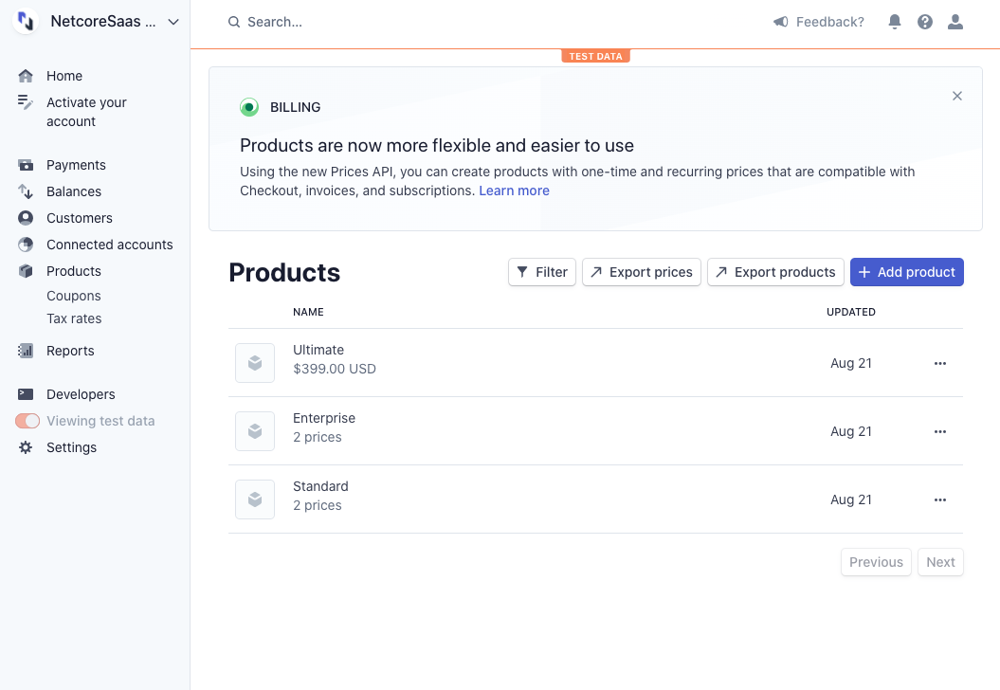
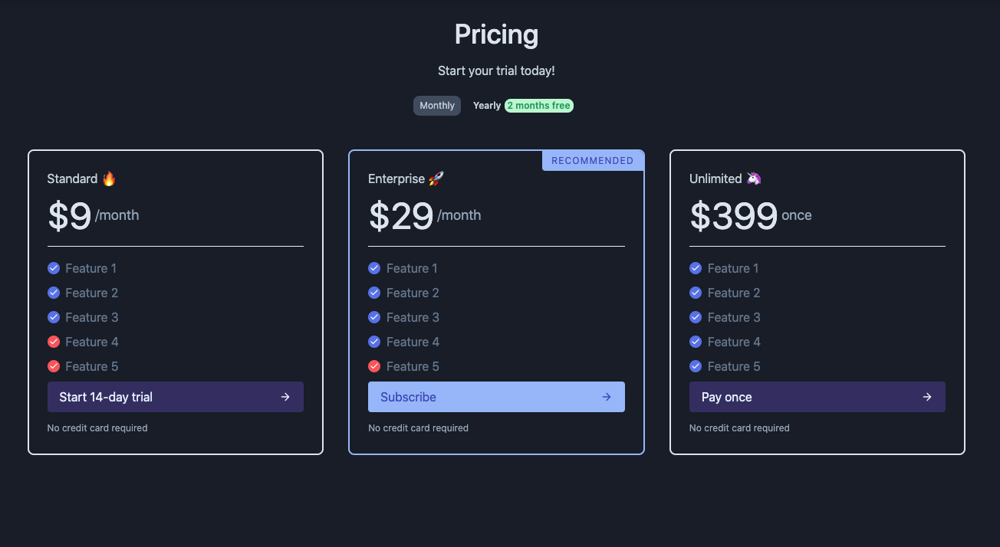

# Creating Stripe Products

### Demo



### Products

| Product Name | Price Type | Billing Period | Price | Trial |
| :--- | :--- | :--- | :--- | :--- |
| Standard | Recurring | Monthly | $9 | 14 days |
| Standard | Recurring | Yearly | $90 \(2 months free\) | 30 days |
| Enterprise | Recurring | Monthly | $29 | ❌ |
| Enterprise | Recurring | Yearly | $290 \(2 months free\) | ❌ |
| Ultimate | One Time | Once | $399 | ❌ |

1. Go your[ products page](https://dashboard.stripe.com/test/products)
2. Set
   1. **Name**: Standard
   2. **Pricing model**: Standard pricing
   3. **Price**: $9
   4. **Billing period**: Monthly
   5. **Trial**: 14 days
   6. Add another price for the Yearly tier 
3. Repeat step 2 for Enterprise but without trial days
4. Now for Ultimate, set **One time** instead of **Recurring**

It should look something like this:



Go to `ClientApp/src/store/modules/pricing/default-pricing.Development.ts` and change the price id's.



```typescript
import Product from "@/app/models/pricing/Product";
import Feature from "@/app/models/pricing/Feature";
import { BillingPeriod, PriceType } from "@/app/models/pricing/Price";

const defaultCurrency: string = "usd";
export const defaultProductsDevelopment: Product[] = [
  new Product(
    "Standard 🔥",
    "border-orange-300 bg-orange-100 inline-flex px-4 py-1 rounded-full text-sm leading-5 font-semibold tracking-wide uppercase border text-indigo-600",
    [
      {
        id: "price_1HJ5kjDoGxBcf8G2BRSGmVVo",
        type: PriceType.Recurring,
        billingPeriod: BillingPeriod.Monthly,
        price: 9,
        currency: defaultCurrency,
        trialDays: 14,
        product: undefined,
      },
      {
        id: "price_1HJ5kjDoGxBcf8G2SUXpDxnS",
        type: PriceType.Recurring,
        billingPeriod: BillingPeriod.Yearly,
        price: 90,
        currency: defaultCurrency,
        trialDays: 30,
        product: undefined,
      },
    ],
    [
      new Feature("Feature 1", true),
      new Feature("Feature 2", true),
      new Feature("Feature 3", true),
      new Feature("Feature 4", false),
      new Feature("Feature 5", false),
    ],
    false
  ),
  new Product(
    "Enterprise 🚀",
    "border-green-300 bg-green-100 inline-flex px-4 py-1 rounded-full text-sm leading-5 font-semibold tracking-wide uppercase border text-indigo-600",
    [
      {
        id: "price_1HJ5l9DoGxBcf8G2RQwzXg0q",
        type: PriceType.Recurring,
        billingPeriod: BillingPeriod.Monthly,
        price: 29,
        currency: defaultCurrency,
        trialDays: 0,
        product: undefined,
      },
      {
        id: "price_1HJ5l9DoGxBcf8G2YzDYNvyP",
        type: PriceType.Recurring,
        billingPeriod: BillingPeriod.Yearly,
        price: 290,
        currency: defaultCurrency,
        trialDays: 0,
        product: undefined,
      },
    ],
    [
      new Feature("Feature 1", true),
      new Feature("Feature 2", true),
      new Feature("Feature 3", true),
      new Feature("Feature 4", true),
      new Feature("Feature 5", false),
    ],
    true
  ),
  new Product(
    "Unlimited 🦄",
    "border-indigo-300 bg-indigo-100 inline-flex px-4 py-1 rounded-full text-sm leading-5 font-semibold tracking-wide uppercase border text-indigo-600",
    [
      {
        id: "price_1HJ5lWDoGxBcf8G2HUGddqQz",
        type: PriceType.OneTime,
        billingPeriod: BillingPeriod.Once,
        price: 399,
        currency: defaultCurrency,
        trialDays: 0,
        product: undefined,
      },
    ],
    [
      new Feature("Feature 1", true),
      new Feature("Feature 2", true),
      new Feature("Feature 3", true),
      new Feature("Feature 4", true),
      new Feature("Feature 5", true),
    ],
    false
  ),
];

```



Your pricing page should be:



Don't forget to update `ClientApp/src/store/modules/pricing/default-pricing.ts` and set your **LIVE** stripe API Keys.

