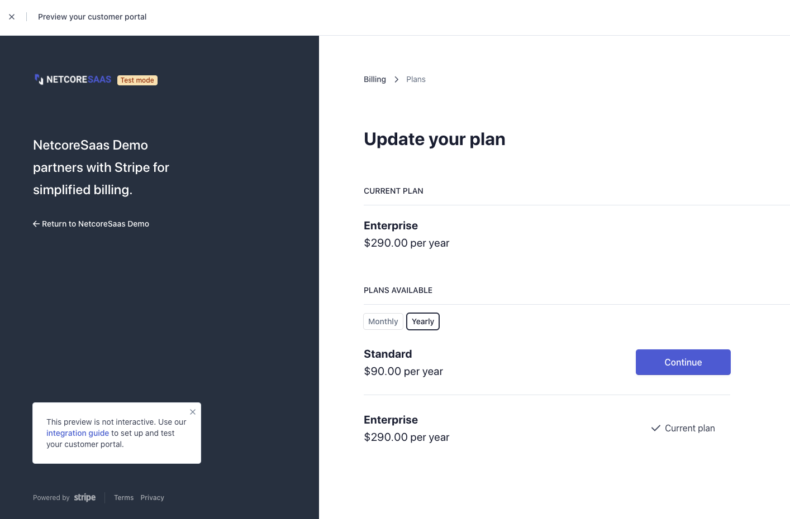

# Creating the Customer Portal

Official docs: [https://stripe.com/docs/billing/subscriptions/customer-portal](https://stripe.com/docs/billing/subscriptions/customer-portal)

### Setting up a customer portal

1. [Change your branding](https://dashboard.stripe.com/settings/branding)
2. [Update your account information](https://dashboard.stripe.com/settings/account)
3. [Configure your customer portal](https://dashboard.stripe.com/test/settings/billing/portal):
   1. **Payment methods**: Enable \(recommended\)
   2. **Cancel subscriptions**: Enable \(your preference\)
   3. **Update subscriptions**: \(your preference\)
   4. **Added products**: Add all your subscription-based products
   5. Links:
      1. **Terms of Service**: https://yourappname.com/terms
      2. **Privacy Policy**: https://yourappname.com/privacy
      3. **Default redirect link**: [http://localhost:8080/app/settings/organization/subscription](http://localhost:8080/app/settings/organization/subscription)

### Preview

