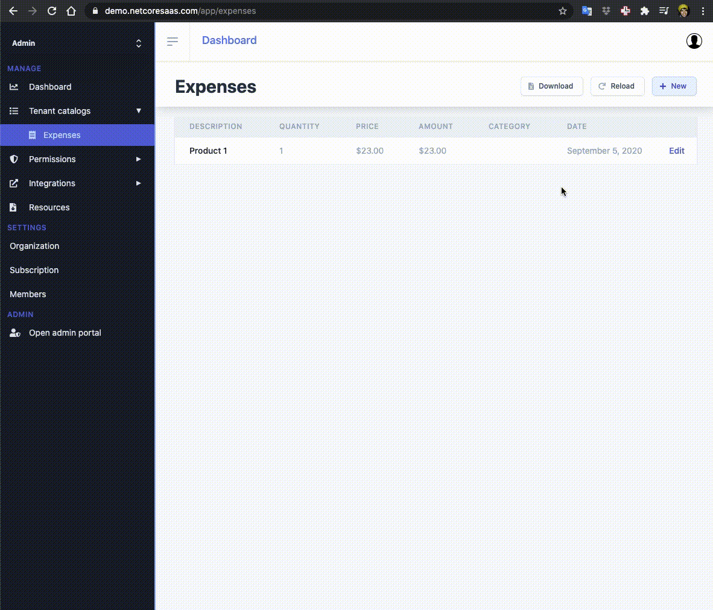

# Creating a new Entity model

## Backend

1. Create Models/\(Master or Core\)/Model.cs
2. Add public DbSet&lt;Model&gt; Model { get; set; } to DbContexts:
   1. If it’s a master model add it to Both DbContexts: MasterDbContext \(for migrations\) or CoreDbContext \(for tenant entities\)
   2. If it’s a core model just add it to MasterDbContext
3. If you configured PostgreSQL, go to OnModelCreating and add:
   1. ValueGeneratedOnAdd\(\).UseSerialColumn\(\);
4. If the model has a list of another Model add builder.Entity&lt;Model&gt;\(\).HasMany\(f =&gt; f.AnotherModelList\);
5. Copy and paste Controllers/TemplateController.cs to Controllers/NewModelController.cs
6. Migration \(add and update\):
   1. `dotnet ef migrations add MigrationName --context MasterDbContext`
   2. `dotnet ef database update --context MasterDbContext`
   3. Verify database model schema. If you got any errors, try commenting the **Up** method on the **Initial.cs** migrations or delete the Migrations folder \(not recommended once in production\).

## Client

1. Copy and paste model to src/app/models \(master or core\), you can use the [C\# to TypeScript](https://marketplace.visualstudio.com/items?itemName=adrianwilczynski.csharp-to-typescript) extension
2. Copy and paste src/services/templateService to src/services/ModelService.ts and implement Controller methods
3. Optional: Add it to src/services/index.ts
4. Optional for multi-language: Change object, plural and property titles on src/locale/en-US/models.json
5. Routes: Add route to appRoutes or adminRoutes and appSidebar or adminSidebar
6. Copy src/views/templates/CRUD/ModelListTemplate
   1. Update import “components/shared/BaseComponent.vue” to relative path so “this.services” is typed.
   2. Rename CHANGE\_MODEL\_NAME to “yourModel”
   3. Rename CHANGE\_MODEL\_TYPE to “YourModel”
   4. Import model type
   5. Rename CHANGE\_SERVICE\_NAME to “yourModels”
   6. Configure 'private columns: ColumnType' to show on list


If you get errors on this.services or this.loading, fix relative paths of '**/app/models/ColumnType**' and '**components/shared/BaseComponent.vue**' 

Example -&gt; '**../../../components...**' instead of '**@/components...**'


## Result

You should get a table and a CRUD form for the model.

